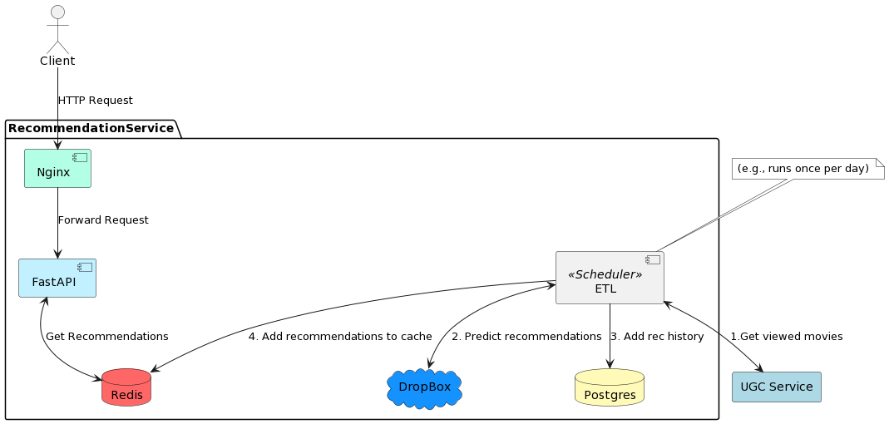

# Система рекомендаций

## Документация
OpenAPI: `http://0.0.0.0:8015/api/openapi`

## Струткура
### Типы рекомендаций
1. Content-based (опция для рекомендации фильмов на основе содержания. "Потому что вы смотрели ХХХ."")
2. Item-based (рекомендация фильмов по их схожести.)

### Компоненты системы
1. Рекомендация по данным сервиса UGC.
2. Рекомендация на основе выбора предпочитаемых фильмов в начале пользования кинотеатром.

#### Пункт 1. 
ETL. Выкачка данных из UGC сервиса (если у пользователя еще нет просмотров, берутся данные их таблицы cold_start) в Redis. 
Запускается раз в день, данные в Redis хранятся сутки.
#### Пункт 2.
Cold start. Пользователь выбирает жанры, на основе которых предлагается выбрать понравившиеся фильмы. После чего сразу генерируются рекомендации.

### Схема

